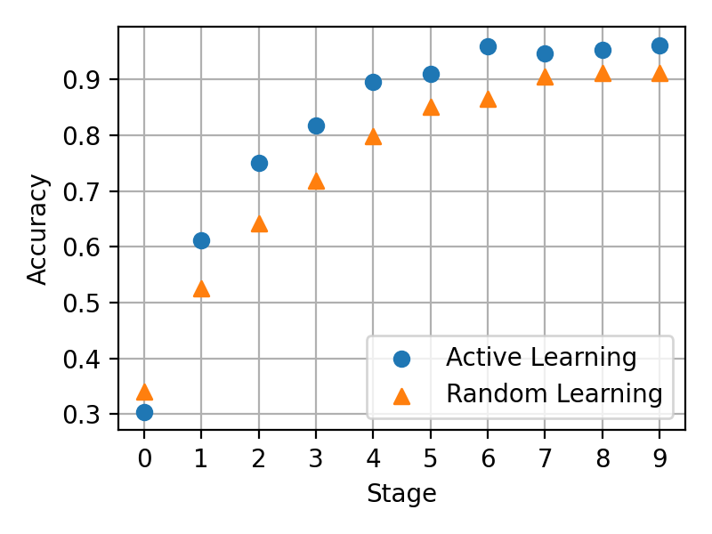

[PyTorch] Learning Loss for Active Learning
=====
PyTorch implementation of "Learning Loss for Active Learning"

## Concept

      
  
Concept ot the Active Learning [1].

## Results
|MNIST|CIFAR10|
|:---:|:---:|
|||

## Requirements
* PyTorch 2.0.1

## Reference
[1] Donggeun Yoo, et al. <a href="https://openaccess.thecvf.com/content_CVPR_2019/html/Yoo_Learning_Loss_for_Active_Learning_CVPR_2019_paper.html">"Learning loss for active learning."</a>  Proceedings of the IEEE/CVF conference on Computer Vision and Pattern Recognition (CVPR). 2019.